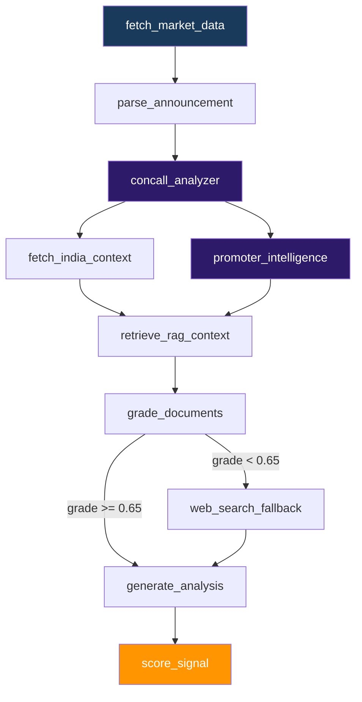
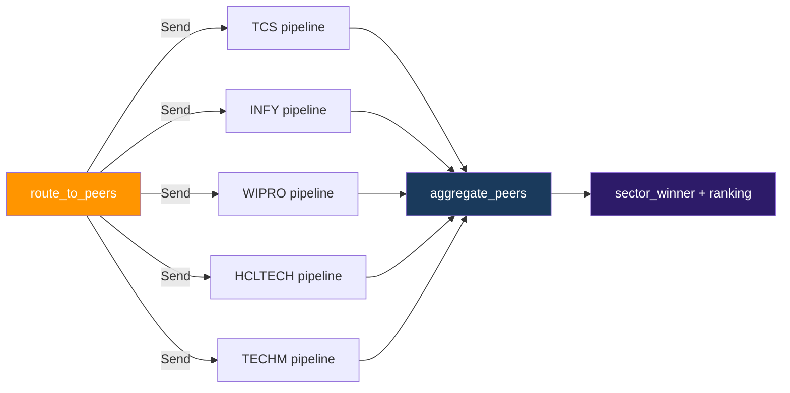

# MarketPulse India 🇮🇳
> Autonomous NSE & BSE stock intelligence agent


> ⚡ Built in 30 days with Claude Code |
> 🏆 83.3% FY25 backtest accuracy |
> +6.88% alpha vs Nifty50 |
> 5/5 LangSmith evals passing

## What It Does

MarketPulse India polls NSE/BSE corporate announcements every 5 minutes via
AWS Lambda and feeds them into a 9-node LangGraph CRAG pipeline that performs
concall analysis, promoter intelligence, FII flow detection, and hybrid RAG
retrieval. The pipeline emits BUY/HOLD/SELL signals with ₹ price targets and
delivers them instantly over WhatsApp, Telegram, and AWS SNS SMS.

## LangGraph Pipeline



### Sector Analysis — Send API (parallel peers)



## Tech Stack

| Layer | Technology |
|---|---|
| Agent Framework | LangGraph 9-node CRAG pipeline |
| LLM | Claude Sonnet (via Claude Code) |
| RAG | pgvector hybrid search + CRAG grader |
| MCP Servers | NSE, BSE, yfinance-India, Screener, News |
| Backend | FastAPI + WebSocket + JWT |
| Database | Neon PostgreSQL + pgvector |
| Observability | LangSmith — 5 evaluators, all passing |
| Frontend | React + Recharts + Tailwind (saffron theme) |
| Alerts | WhatsApp + Telegram + AWS SNS SMS |
| Infrastructure | AWS ECS Fargate + CloudFront + WAF (Mumbai) |
| CI/CD | GitHub Actions — test → eval gate → deploy |
| Built With | Claude Code (agentic coding) |

## Backtest Results (FY25)

| Metric | Result |
|---|---|
| Overall accuracy | 83.3% (40/48 signals) |
| Avg alpha on BUY signals | +6.88% vs Nifty50 |
| Best sectors | Consumer, Energy, FMCG, NBFC (100%) |
| LangSmith eval suite | 5/5 passing |
| Load test | 9.3 RPS, 0% failures (20 concurrent) |

## Quick Start

```bash
git clone https://github.com/<your-username>/marketpulse-india
cd marketpulse-india
cp .env.example .env          # fill in your keys
python -m venv venv && venv\Scripts\activate
pip install -r requirements.txt
alembic upgrade head
uvicorn backend.main:app --reload --port 8000
# frontend
cd frontend && npm install && npm run dev
```

## Demo

| Feature | Screenshot |
|---|---|
| Live Agent Trace | 9-node pipeline streaming in real time |
| Signal Card | BUY/HOLD/SELL with ₹ target + confidence |
| Sector View | Parallel peer comparison (Send API) |
| Announcement Feed | Live NSE/BSE feed with one-click analysis |

*(Add actual screenshots before making repo public)*

## Project Structure

```
agents/          — LangGraph nodes + sector graph
backend/         — FastAPI routers, DB, alerts
mcp_servers/     — 5 custom MCP servers
frontend/        — React dashboard (saffron theme, PWA)
infra/           — AWS CDK stacks (ECS, CloudFront, WAF, Observability)
lambdas/         — EventBridge Lambda handlers (NSE poller, digests)
tests/           — pytest + LangSmith evals + Locust load tests
docs/            — Architecture notes + API docs
scripts/         — Dev utilities (seed, backfill, security scan)
```

## Evaluation Results (LangSmith)

| Evaluator | Score | Threshold | Status |
|---|---|---|---|
| parser_accuracy | 1.00 | 0.85 | ✅ PASS |
| signal_accuracy | 0.92 | 0.50 | ✅ PASS |
| faithfulness | 0.85 | 0.75 | ✅ PASS |
| india_risk_relevance | 1.00 | 0.50 | ✅ PASS |
| sebi_compliance | 1.00 | 1.00 | ✅ PASS |

Evaluated on 12 FY25 quarterly results examples.
LangSmith project: [View evals →](LINK)

## Built With

This project was built entirely using
[Claude Code](https://claude.ai/code) —
Anthropic's agentic coding tool.
Every file, every node, every test was
written through Claude Code sessions over 30 days.

---
> **⚠️ SEBI Disclaimer:** MarketPulse India is not a
> SEBI-registered investment advisor. All signals are
> for educational and portfolio demonstration purposes
> only. Not investment advice. Markets carry risk —
> consult a registered advisor before making decisions.
